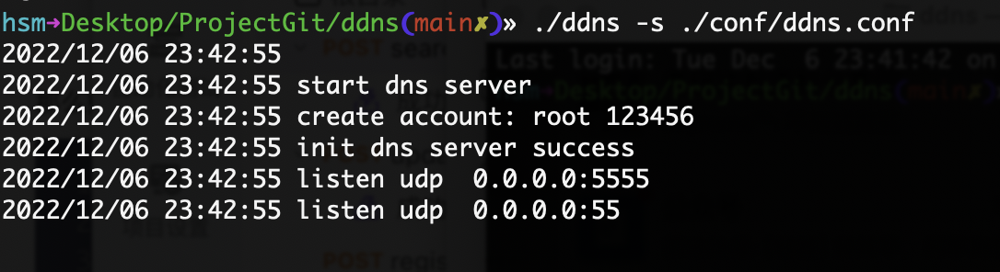
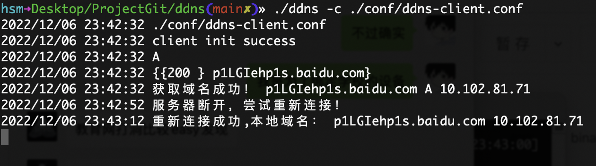
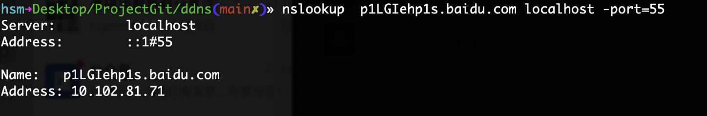

# ddns
A simple DNS server that also acts as a DDNS server


# usage
## server

```bash
./ddns -s ./conf/ddns.conf 
```


## client
```text
./ddns -c ./conf/ddns-client.conf
```



# test



# DDNS Server API

## POST show
### 请求参数

|名称|位置|类型|必选|说明|
|---|---|---|---|---|
|body|body|object| 否 |none|
|» token|body|string| 是 |none|

> 返回示例

> 200 Response

```json
{"code":200,"msg":"","data":[{"domain":"a.baidu.co,","value":"192.168.1.1","dns_type":"A","ttl":0},{"domain":"aaaa.baidu.com","value":"\u003cnil\u003e","dns_type":"A","ttl":0},{"domain":"cname.baidu.com","value":"cname.baidu.co","dns_type":"CNAME","ttl":0}]}
```

> 500 Response

```json
{"code":500,"msg":"","data":""}
```

## POST update

### 请求参数

|名称|位置|类型|必选|说明|
|---|---|---|---|---|
|body|body|object| 否 |none|
|» domain|body|string| 是 |none|
|» dnsType|body|string| 是 |none|
|» value|body|string| 是 |none|
|» token|body|string| 是 |none|

> 返回示例

> 200 Response

```json
{"code":200,"msg":""}
```


### 返回数据结构

## POST register
### 请求参数

|名称|位置|类型|必选|说明|
|---|---|---|---|---|
|body|body|object| 否 |none|
|» root_token|body|string| 是 |none|
|» user|body|string| 是 |none|
|» password|body|string| 是 |none|

> 返回示例

> 200 Response

```json
{"code":200,"msg":""}
```


## POST create_domain
### 请求参数

|名称|位置|类型|必选|说明|
|---|---|---|---|---|
|body|body|object| 否 |none|
|» dns_type|body|string| 是 |none|
|» value|body|string| 是 |none|
|» time|body|string| 是 |none|
|» token|body|string| 是 |none|

> 返回示例

> 200 Response

```json
{"code":200,"msg":""}
```


